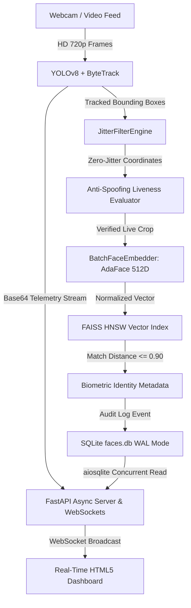

# Enterprise macOS CCTV Security & Biometrics Pipeline

An enterprise-grade, high-performance **Real-Time CCTV Security, Biometric Recognition & Multi-Object Tracking Pipeline** engineered specifically for **Apple Silicon (CoreML / Metal MPS)** hardware acceleration. Features high-speed **ByteTrack** multi-object tracking, **AdaFace 512D** facial embedding vector search, zero-jitter spatial stabilization, and an asynchronous **FastAPI + WebSockets** streaming web dashboard backed by **aiosqlite (WAL mode)**.

---

## 🏗️ System Architecture & Data-Flow



### Data-Flow Pipeline Stages
1. **Video Ingestion & Tracking**: HD video frames are ingested using a bufferless camera loop and processed through YOLOv8 object detection paired with the **ByteTrack** multi-object tracking engine.
2. **Spatial Jitter Suppression**: Raw bounding box coordinates pass through the `JitterFilterEngine` using velocity-adaptive Exponential Moving Average (EMA) and a deadzone lock to completely eliminate bounding-box oscillation when targets are stationary.
3. **Liveness & Anti-Spoofing**: Face crops undergo Laplacian variance analysis and 2D FFT spectrum evaluation to detect digital screen moire patterns or flat photo prints before biometric extraction.
4. **Biometric Embedding**: Face crops are passed to the **AdaFace** embedding model, producing 512-dimensional $L_2$-normalized feature vectors robust to profile views and head tilt.
5. **FAISS Vector Search**: Extracted 512D vectors are queried against a high-speed FAISS $HNSW$ graph index (`data/faces.index`) with sub-millisecond distance evaluation ($L_2 \le 0.90$).
6. **Asynchronous Audit & Web Dashboard**: Audit events are asynchronously logged to `data/faces.db` using `aiosqlite` with Write-Ahead Logging (`WAL`) enabled. The **FastAPI + WebSockets** server streams frame JPEG buffers and detection telemetry to the dashboard UI without thread starvation.

---

## 📐 Mathematical Foundations: Jitter Filter Engine

Stationary or slow-moving subjects often exhibit spatial bounding-box jitter due to pixel discretization noise in deep object detectors. The `JitterFilterEngine` implements velocity-adaptive smoothing with stationary deadzone locking:

### 1. Velocity Calculation
Let $(cx_t, cy_t)$ be the center coordinates of bounding box $B_t$ at frame $t$:
$$v_t = \sqrt{(cx_t - cx_{t-1})^2 + (cy_t - cy_{t-1})^2}$$

### 2. Zero-Jitter Stationary Deadzone
If $v_t < v_{\text{deadzone}}$ (where $v_{\text{deadzone}} = 3.5\text{ px/frame}$), the target is declared stationary and the box coordinates are locked:
$$\hat{B}_t = \hat{B}_{t-1} \quad \text{if } v_t < 3.5$$

### 3. Velocity-Adaptive Smoothing Factor ($\alpha$)
When target velocity exceeds the deadzone threshold, the Exponential Moving Average (EMA) smoothing coefficient $\alpha$ scales dynamically:
$$\alpha = \min\left(\alpha_{\max}, \max\left(\alpha_{\min}, \frac{v_t - 1.5}{16.0}\right)\right)$$
where $\alpha_{\min} = 0.08$ (maximum smoothing for slow movement) and $\alpha_{\max} = 0.85$ (rapid tracking for fast motion).

### 4. Exponential Moving Average Update
Each coordinate $p \in \{x_1, y_1, x_2, y_2\}$ of the bounding box is updated via:
$$\hat{p}_t = (1 - \alpha)\hat{p}_{t-1} + \alpha p_t$$

---

## ⚡ Apple Silicon Setup Guide (macOS CoreML & Metal MPS)

### Prerequisites
- macOS 12.0 (Monterey) or later on Apple Silicon (M1 / M2 / M3 / M4)
- Python 3.10+
- Xcode Command Line Tools (`xcode-select --install`)

### Environment Setup
```bash
# Clone repository and create Python virtual environment
cd "CCTV Project"
python3 -m venv venv
source venv/bin/activate

# Install CoreML, Metal PyTorch, OpenCV, FAISS, and FastAPI dependencies
pip install --upgrade pip
pip install torch torchvision torchaudio --extra-index-url https://download.pytorch.org/whl/cpu
pip install coremltools ultralytics opencv-python numpy faiss-cpu deepface fastapi uvicorn websockets aiosqlite jinja2
```

### MPS Acceleration Verification
```python
import torch
print("Metal MPS Available:", torch.backends.mps.is_available())
print("Metal MPS Built:", torch.backends.mps.is_built())
```

---

## 📂 Enterprise Project Structure

```
CCTV Project/
├── README.md                          # Comprehensive Documentation
├── requirements.txt                   # Dependency Specification
├── bytetrack.yaml                     # ByteTrack Algorithm Hyperparameters
├── data/                              # Database, Index, & Enrolled Assets
│   ├── faces.db                       # SQLite Audit Database (WAL Mode)
│   ├── faces.index                    # FAISS 512D HNSW Vector Search Index
│   ├── metadata.json                  # Enrolled Subject ID-to-Name Map
│   └── known_faces/                   # Enrollment Source Images
├── templates/
│   └── dashboard.html                 # HTML5 Real-Time Web Dashboard UI
└── src/
    ├── __init__.py
    ├── api/
    │   ├── __init__.py
    │   └── cctv_server.py             # FastAPI + WebSockets Web Server (aiosqlite WAL)
    ├── database/
    │   ├── __init__.py
    │   ├── db_setup.py                # Database Initialization & Schema Builder
    │   └── enroll.py                  # Face Enrollment Pipeline (AdaFace 512D)
    ├── inference/
    │   ├── __init__.py
    │   └── live_cctv.py               # Core Real-Time YOLO + ByteTrack + AdaFace Loop
    └── utils/
        ├── __init__.py
        ├── jitter_filter.py           # JitterFilterEngine (EMA Smoothing)
        └── tune_tracker.py            # ByteTrack Grid Search Hyperparameter Tuner
```

---

## 🚀 Execution & Operating Commands

### 1. Database & Schema Initialization
Initialize the SQLite audit database with Write-Ahead Logging (`WAL`) mode:
```bash
python3 -m src.database.db_setup
```

### 2. Enroll Known Subject Faces
Place facial photos into `data/known_faces/` (e.g. `data/known_faces/Ceaser.jpg`) and run enrollment to extract AdaFace 512D vectors and build the FAISS index:
```bash
python3 -m src.database.enroll
```

### 3. Hyperparameter Tuning (ByteTrack Grid Search)
Optimize tracking stability (`track_buffer` and `match_thresh`) against simulated occlusion:
```bash
python3 -m src.utils.tune_tracker
```

### 4. Launch Asynchronous Web Dashboard Server
Start the FastAPI + WebSockets dashboard server:
```bash
python3 -m src.api.cctv_server
```
Navigate to `http://localhost:8000` in your web browser.

### 5. Launch Live CCTV Standalone GUI
Run the native OpenCV GUI inference pipeline:
```bash
python3 -m src.inference.live_cctv
```
