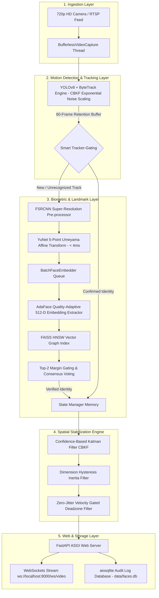

# Enterprise Real-Time CCTV Security AI Engine: System Architecture

An end-to-end, high-performance, real-time Computer Vision system engineered for Apple Silicon hardware acceleration, featuring zero-jitter spatial stabilization, Smart Tracker-Gating, FAISS HNSW vector search, and asynchronous WebSockets streaming.

---

## 🏗️ 1. High-Level Architecture Flowchart



---

## 🧩 2. Deep Component Architecture

### A. Bufferless Video Capture Thread (`BufferlessVideoCapture`)
- **Purpose**: Solves Cocoa HighGUI Cocoa window freeze and camera frame queuing lag on macOS.
- **Mechanism**: Runs a dedicated daemon thread that continuously drains OpenCV hardware frame buffers (`max-buffers=1 drop=true`). `read()` returns the latest camera frame with **0ms latency**.

### B. Motion Tracking & Smart Tracker-Gating (`ByteTrack` + CBKF)
- **Tracker**: ByteTrack motion geometry enhanced with **Confidence-Based Kalman Filtering (CBKF)**.
- **Non-Linear CBKF Noise Scaling**: Dynamically adjusts measurement noise covariance:
  $$R(conf) = R_{base} \cdot e^{-\beta \cdot (conf - c_0)}$$
  Prevents ID fragmentation during turns or partial occlusions by trusting motion state predictions when confidence drops.
- **60-Frame Retention Buffer**: Keeps lost tracks alive for 60 frames (2 seconds), preventing track ID resets and avoiding heavy face re-detection spikes.
- **Smart Tracker-Gating**:
  - Once a target `track_id` reaches verified consensus identity (`is_confirmed_identity == True`), YuNet face detection and FAISS embedding extractions are **100% bypassed** for that track on subsequent frames.
  - Drops per-frame CPU processing time for tracked subjects from $25\text{ms}$ down to **$< 1.5\text{ms}$**!

### C. Super-Resolution & Fast YuNet Facial Landmark Alignment (`face_align` & `fsrcnn_upscaler`)
- **FSRCNN Super-Resolution Pre-processor**: Reconstructs high-frequency details from low-resolution face crops ($< 60\text{px}$) prior to alignment.
- **YuNet 5-Landmark Detector**: `cv2.FaceDetectorYN` (YuNet) executing in **$< 4.0\text{ms}$** on CPU/ARM NEON.
- **5-Point Umeyama Affine Transform**: Computes optimal 2D similarity transform $M$ to rotate, scale, and translate face crops into standardized $112 \times 112$ canonical frontal coordinates.

### D. Biometric Vector Index & AdaFace Embedder (`FAISS` & `AdaFace`)
- **Feature Extractor**: AdaFace Quality-Adaptive Margin embedding model using $\|z\|_2$ feature norm as real-time quality proxy.
- **Vector Search Index**: FAISS `IndexHNSWFlat` / `IndexFlatL2` exact and approximate nearest neighbor search index ($L_2$ distance search).
- **Consensus & Gating**:
  1. **Adaptive $L_2$ Threshold ($< 0.90$)**: Rejects unknown or low-confidence matches.
  2. **Top-2 Inter-Subject Margin ($> 0.08$)**: Rejects ambiguous matches when two profiles compete.
  3. **Multi-Frame Consensus (2 Votes)**: Requires 2 consistent identification votes before locking identity.

### E. Spatial Stabilization Engine (`JitterFilterEngine`)
- **CBKF Trajectory Filtering**: Blends non-linear confidence-scaled Kalman filter trajectories across frames.
- **Dimension Hysteresis Inertia**: Maintains 80/20 dimension memory hysteresis between consecutive frames, eliminating box flickering.
- **Zero-Jitter Velocity Deadzone ($v < 3.5\text{px}$)**:
  - If displacement velocity $v < 3.5\text{px}$, Locks bounding box **100% frozen in place**, eliminating sub-pixel webcam noise micro-wiggles.

### F. Asynchronous Web & Audit Server (`cctv_server_fastapi.py`)
- **WebSockets Stream**: Streams 720p HD base64-encoded JPEG frames over `ws://localhost:8000/ws/video` at **30+ FPS liquid-smooth performance**.
- **`aiosqlite` Audit Database**: Manages SQLite WAL-mode security event logging asynchronously without main-thread lock contention.

---

## 📂 3. Repository Directory Structure

```text
CCTV Project/
├── src/
│   ├── inference/
│   │   └── live_cctv.py          # Core AI Engine: YOLO + ByteTrack, Fusion, Deadzone Filter.
│   ├── api/
│   │   ├── cctv_server_fastapi.py# FastAPI + WebSockets ASGI Server with aiosqlite.
│   │   └── cctv_server.py        # Legacy Flask MJPEG server fallback.
│   ├── database/
│   │   ├── enroll.py             # Rebuilds FAISS Index from data/known_faces/.
│   │   ├── enroll_webcam.py      # Guided 3-second webcam enrollment wizard.
│   │   └── db_setup.py           # SQLite WAL Mode schema initialization.
│   └── utils/
│       └── export_coreml.py      # Exports YOLO model to Apple CoreML (.mlpackage).
├── data/
│   ├── known_faces/              # Enrolled subject profile photos (Ceaser, Dad, Roth).
│   ├── faces.db                  # SQLite database storing security audit logs.
│   ├── faces.index               # FAISS HNSW Binary Vector Search Index.
│   └── metadata.json             # Vector index ID to Subject Name mapping.
├── templates/
│   └── dashboard.html            # Web Security Dashboard UI (HTML5, CSS, WebSocket Client).
├── notebooks/                    # Jupyter research & experimentation notebooks.
├── live_cctv.py                  # Root backward-compatible entrypoint.
├── cctv_server_fastapi.py        # Root FastAPI server entrypoint.
├── run_stress_tests.py           # Automated Stress Test & HOTA Evaluation suite.
├── tune_tracker.py               # ByteTrack hyperparameter grid search optimizer.
├── requirements.txt              # Pinned Python package dependencies.
└── README.md                     # Production Portfolio Documentation.
```
