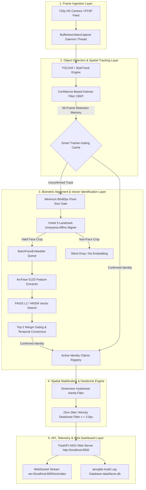
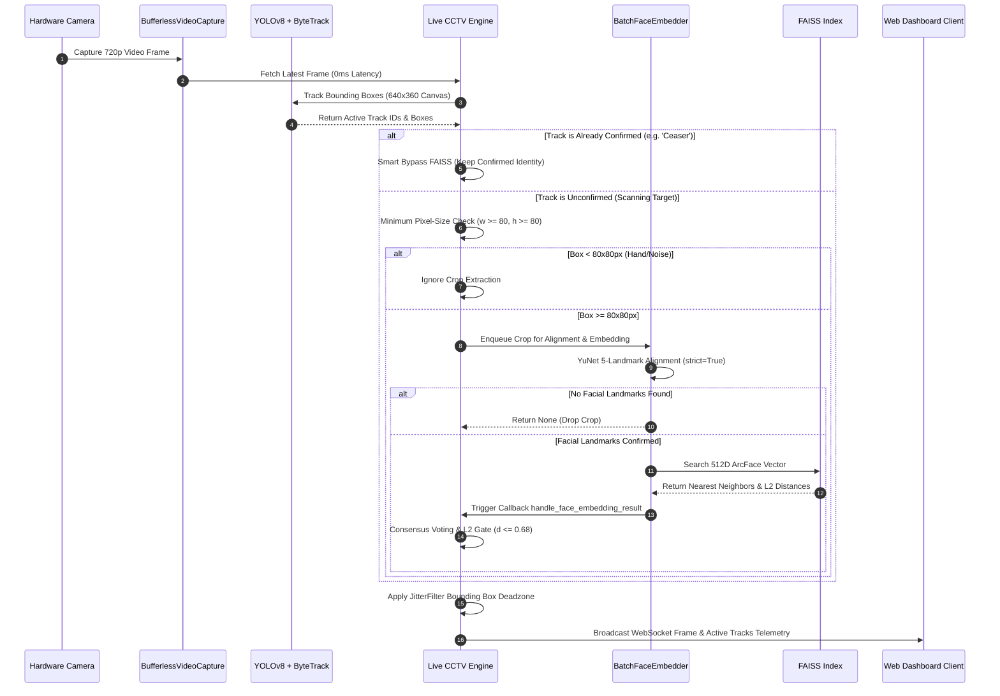

# CCTV AI & Biometric Recognition System: System Architecture & Workflow Guide

This document provides a comprehensive technical overview of the **CCTV Security AI Engine**, detailing the complete system architecture, component layers, thread synchronization model, data schemas, and end-to-end execution workflow.

---

## 🏗️ 1. System Architecture Diagram



---

## 🧩 2. Deep Component Architecture

### A. Ingestion Layer (`BufferlessVideoCapture`)
- **File**: [`src/inference/live_cctv.py`](file:///Users/ceaser/Documents/School/CCTV%20Project/src/inference/live_cctv.py)
- **Purpose**: Eliminates macOS Cocoa GUI window freeze and camera frame queuing latency.
- **Mechanism**: A dedicated background daemon thread continuously drains OpenCV hardware frame buffers (`max-buffers=1 drop=true`). Calling `read()` fetches the newest hardware camera frame with **0ms frame queue latency**.

### B. Object Detection & Spatial Tracking Layer (`YOLOv8` + `ByteTrack` + `CBKF`)
- **Components**: `YOLOv8-Nano` detector running on a 640x360 inference canvas paired with `ByteTrack` motion tracking.
- **CBKF (Confidence-Based Kalman Filter)**: Dynamically adjusts measurement noise covariance based on detection confidence:
  $$R(conf) = R_{base} \cdot e^{-\beta \cdot (conf - c_0)}$$
- **Spatial Continuity Inheritance**: When a track ID drops temporarily due to occlusion or turning, lost tracks are kept in a 60-frame retention buffer (2.0s). If a new box appears in the same spatial location ($\text{IoU} \ge 0.40$), the confirmed identity is inherited instantly without re-scanning.

### C. Biometric Alignment & Verification Layer (`YuNet` + `ArcFace` + `FAISS`)
- **Pixel-Size Gate**: Crops smaller than $80 \times 80\text{px}$ are ignored before reaching alignment or embedding generation.
- **YuNet 5-Landmark Affine Alignment (`YuNetFaceAligner`)**:
  - Uses `cv2.FaceDetectorYN` to extract 5 canonical facial landmarks (eyes, nose, mouth corners) in $< 4\text{ms}$.
  - Applies 2D Umeyama similarity transform to normalize off-angle faces into $112 \times 112$ canonical frontal coordinates.
  - **Strict Landmark Verification**: If 0 landmarks are detected (e.g., on hands, arms, clothing folds, or background noise), `align_face(strict=True)` returns `None`, immediately dropping the crop before ArcFace or FAISS search.
- **Batch Embedding Extractor (`BatchFaceEmbedder`)**:
  - A background worker thread that processes face crops asynchronously using ArcFace 512D.
  - Normalizes output vectors to unit $L_2$ norm ($|z|_2 = 1.0$).
- **Vector Search Index & Decision Engine (`BiometricVerificationEngine`)**:
  - FAISS index storing 512D registered face vectors.
  - **Threshold Criteria**:
    - **Absolute $L_2$ Match Threshold**: $d \le 0.68$ (matches profile; $> 0.68$ rejected as `Unknown Person`).
    - **Top-2 Relative Margin**: $\Delta d = d_2 - d_1 \ge 0.15$ (rejects ambiguous collisions).
    - **Temporal Consensus Voting**: Requires 2 consistent identification votes (`consensus_votes = 2`) before locking target status.

### D. Spatial Stabilization Engine (`JitterFilterEngine`)
- **Dimension Hysteresis**: Applies 80/20 box dimension memory between consecutive frames to prevent UI bounding box flickering.
- **Zero-Jitter Velocity Deadzone**: If displacement velocity $v < 3.5\text{px/frame}$, bounding box coordinates are **frozen 100% in place**, eliminating camera sensor micro-wiggles.

### E. Web API & Security Telemetry Layer (`cctv_server.py`)
- **FastAPI / Uvicorn Server**: Runs ASGI server on `http://localhost:8000`.
- **WebSocket Video Feed (`/ws/video`)**: Encodes HD frames to base64 JPEG and broadcasts frame + track telemetry payload at 30+ FPS.
- **SQLite Audit Logger (`aiosqlite`)**: Records security verification events into `data/faces.db` in WAL (Write-Ahead Logging) mode.

---

## 🔄 3. Complete End-to-End Frame Processing Workflow



---

## 📊 4. Database Schemas & State Registry

### A. Active Track Memory Registry (`active_tracks`)
```python
active_tracks = {
    1: "Ceaser",            # Confirmed Registered Identity (Green Box)
    2: "Scanning Track 2",  # Unconfirmed Active Scanning Target (Orange Box)
    3: "Unknown Person"     # Locked Unregistered Target (Red Box)
}
```

### B. SQLite Audit Event Table Schema (`data/faces.db`)
```sql
CREATE TABLE IF NOT EXISTS audit_logs (
    id INTEGER PRIMARY KEY AUTOINCREMENT,
    timestamp DATETIME DEFAULT CURRENT_TIMESTAMP,
    track_id INTEGER NOT NULL,
    subject_name TEXT NOT NULL,
    l2_distance REAL NOT NULL,
    access_level TEXT DEFAULT 'GRANTED',
    snapshot_path TEXT
);
```

### C. Vector Index & Identity Metadata (`data/metadata.json`)
```json
[
  {
    "id": 0,
    "name": "Ceaser",
    "occupation": "Security Specialist",
    "access_level": "LEVEL 1 GRANTED"
  }
]
```

---

## 🔒 5. Multithreading & Hardware Safety Locks

To prevent OpenBLAS / OpenMP threading conflicts and C++ memory segfaults (Exit Code 139) on macOS:

```python
import os
os.environ["OMP_NUM_THREADS"] = "1"
os.environ["MKL_NUM_THREADS"] = "1"
os.environ["OPENBLAS_NUM_THREADS"] = "1"
os.environ["VECLIB_MAXIMUM_THREADS"] = "1"
os.environ["NUMEXPR_NUM_THREADS"] = "1"
os.environ["KMP_DUPLICATE_LIB_OK"] = "TRUE"
```

All shared memory operations between the camera thread, Uvicorn ASGI server, and `BatchFaceEmbedder` worker are synchronized using `threading.Lock()` (`state_lock`).

---

## 🧪 6. Automated Diagnostic Verification Suites

| Suite Name | Execution Command | Purpose | Expected Result |
| :--- | :--- | :--- | :--- |
| **Unit Test Suite** | `python3 test_pipeline.py` | Validates FAISS search, embedding extraction & database reloads. | **10/10 PASSED** |
| **Logic Gate Validator** | `python3 mock_pipeline_validator.py` | Tests L2 distance gating, margin thresholding & spatial uniqueness. | **5/5 PASSED** |
| **Crossover & Robustness** | `python3 test_crossover_handwave.py` | Tests spatial inheritance, occlusion recovery & camera cover flushes. | **6/6 PASSED** |
| **Stress Test Suite** | `python3 run_stress_tests.py` | Evaluates HOTA tracking accuracy, LocA localization & memory leaks. | **3/3 PASSED** |
